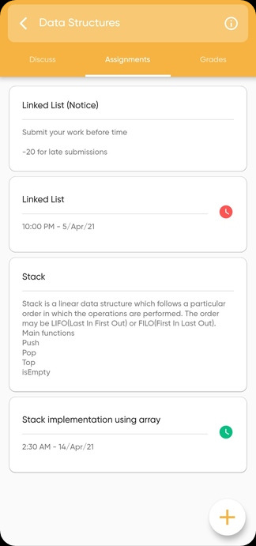

# SmartLearn 
>SmartLearn aims to create a interface for teachers to simply create, distribute, and grade assignments. And where students can ask doubt, submit work and view their progress. 

## Screenshots

## 1. Classroom 

## 2. Assignment Creation (For Teacher)

***

## 3. Assignment Submission (For Teacher)

***

## 4. Assigned Assignment (For Student) 

***

## 5. Assignment Result (For Student)

***

## 6. Classroom Chat

***

## 7. To Do List Creation

***

## Built with
* Frontend - [Flutter](https://github.com/flutter/flutter)
* Backend - [DRF](https://www.django-rest-framework.org/)

## Features
* Authentication with Email verification
* Discussion between students and teacher
* Teacher can categorise student's answer sheet 
* Teacher can create notice
* Single view to see all assignment's status and grades
* To do list
* And many more

## Acknowledgements
* Designed by
  - [Kirtanya Kardum](https://www.behance.net/kirtanyakardum)
* Developed by 
  - [Nidhi Sharma](https://github.com/NidhiSharma1408)
  - [Utkarsh Patel](https://github.com/arshutk)
  - [Somesh Mishra](https://github.com/somesh37)

> Here's the [link](https://github.com/SOMESH37/SmartLearn) for app repo  
